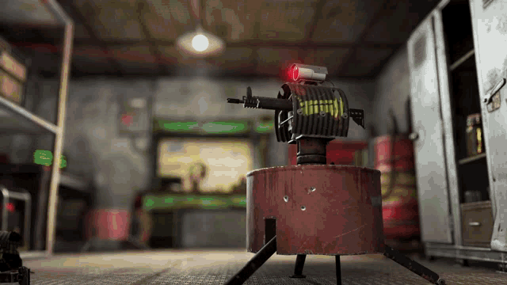

# Zapret Rust Launcher

Автоматический лаунчер для **zapret-discord-youtube** с поддержкой игры в **Rust**.



## Проблема

Античит Rust блокирует WinDivert драйвер, который использует zapret для разблокировки Discord/YouTube. При запуске игры через обычный zapret — он закрывается.

## Решение

Этот лаунчер:
1. Cкачивает последнюю версию zapret с GitHub
2. Останавливает и удаляет WinDivert перед запуском
3. Запускает zapret

## ВАЖНО

Запускайте перед запуском Rust

Нельзя в service.bat выбирать 1. Install Service и если у вас в оргинальном Zapret устоновлен Install Service то удалите Install Service

Если что не работает попробуйте полазить настройках Zapret

И кроме github не где нету.

Не ведитесь фэйковые тг канлы.

## Установка

1. Скачайте и распакуйте архив
2. Запустите `launch.bat` от имени администратора (или просто дважды кликните — запрос прав произойдёт автоматически)

## Как это работает

```
launch.bat
    │
    ├── Проверка/скачивание последней версии zapret
    ├── sc stop windivert
    ├── sc delete windivert
    └── Запуск general (ALT9).bat из zapret
```

## Автоматическое обновление

При каждом запуске скрипт проверяет последний релиз на GitHub и скачивает его при наличии обновлений.

## Требования

- Windows 10/11
- Права администратора (запрашиваются автоматически)
- Подключение к интернету (для обновлений)

## Примечание

- Для работы zapret требуются драйверы WinDivert

## Credits

- [zapret-discord-youtube](https://github.com/Flowseal/zapret-discord-youtube) - основной проект

## Это мой 1 проект
Не судите строго помогала мне неросеть при создания.
